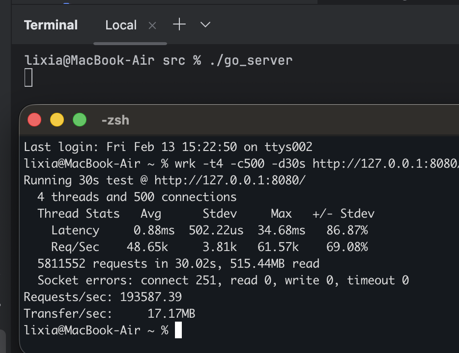
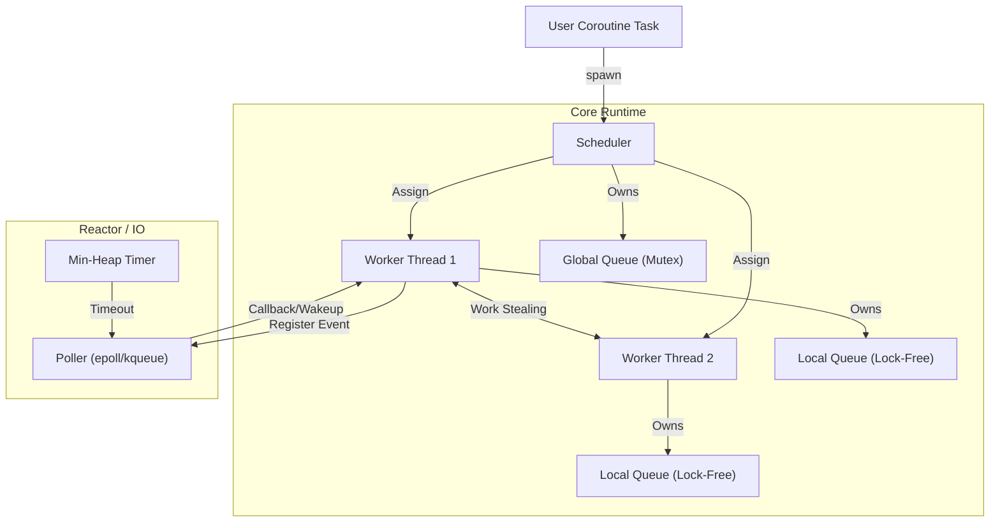

# tiny_coro: A C++20 Educational Asynchronous Runtime

---

[](https://opensource.org/licenses/MIT)
[](https://creativecommons.org/licenses/by-nc-sa/4.0/)

[![zread](https://img.shields.io/badge/Ask_Zread-_.svg?style=flat&color=00b0aa&labelColor=000000&logo=data%3Aimage%2Fsvg%2Bxml%3Bbase64%2CPHN2ZyB3aWR0aD0iMTYiIGhlaWdodD0iMTYiIHZpZXdCb3g9IjAgMCAxNiAxNiIgZmlsbD0ibm9uZSIgeG1sbnM9Imh0dHA6Ly93d3cudzMub3JnLzIwMDAvc3ZnIj4KPHBhdGggZD0iTTQuOTYxNTYgMS42MDAxSDIuMjQxNTZDMS44ODgxIDEuNjAwMSAxLjYwMTU2IDEuODg2NjQgMS42MDE1NiAyLjI0MDFWNC45NjAxQzEuNjAxNTYgNS4zMTM1NiAxLjg4ODEgNS42MDAxIDIuMjQxNTYgNS42MDAxSDQuOTYxNTZDNS4zMTUwMiA1LjYwMDEgNS42MDE1NiA1LjMxMzU2IDUuNjAxNTYgNC45NjAxVjIuMjQwMUM1LjYwMTU2IDEuODg2NjQgNS4zMTUwMiAxLjYwMDEgNC45NjE1NiAxLjYwMDFaIiBmaWxsPSIjZmZmIi8%2BCjxwYXRoIGQ9Ik00Ljk2MTU2IDEwLjM5OTlIMi4yNDE1NkMxLjg4ODEgMTAuMzk5OSAxLjYwMTU2IDEwLjY4NjQgMS42MDE1NiAxMS4wMzk5VjEzLjc1OTlDMS42MDE1NiAxNC4xMTM0IDEuODg4MSAxNC4zOTk5IDIuMjQxNTYgMTQuMzk5OUg0Ljk2MTU2QzUuMzE1MDIgMTQuMzk5OSA1LjYwMTU2IDE0LjExMzQgNS42MDE1NiAxMy43NTk5VjExLjAzOTlDNS42MDE1NiAxMC42ODY0IDUuMzE1MDIgMTAuMzk5OSA0Ljk2MTU2IDEwLjM5OTlaIiBmaWxsPSIjZmZmIi8%2BCjxwYXRoIGQ9Ik0xMy43NTg0IDEuNjAwMUgxMS4wMzg0QzEwLjY4NSAxLjYwMDEgMTAuMzk4NCAxLjg4NjY0IDEwLjM5ODQgMi4yNDAxVjQuOTYwMUMxMC4zOTg0IDUuMzEzNTYgMTAuNjg1IDUuNjAwMSAxMS4wMzg0IDUuNjAwMUgxMy43NTg0QzE0LjExMTkgNS42MDAxIDE0LjM5ODQgNS4zMTM1NiAxNC4zOTg0IDQuOTYwMVYyLjI0MDFDMTQuMzk4NCAxLjg4NjY0IDE0LjExMTkgMS42MDAxIDEzLjc1ODQgMS42MDAxWiIgZmlsbD0iI2ZmZiIvPgo8cGF0aCBkPSJNNCAxMkwxMiA0TDQgMTJaIiBmaWxsPSIjZmZmIi8%2BCjxwYXRoIGQ9Ik00IDEyTDEyIDQiIHN0cm9rZT0iI2ZmZiIgc3Ryb2tlLXdpZHRoPSIxLjUiIHN0cm9rZS1saW5lY2FwPSJyb3VuZCIvPgo8L3N2Zz4K&logoColor=ffffff)](https://zread.ai/lixiasky-back/tiny_coro-build_your_own_MN_scheduler)
---
**Note**: Based on trade-offs regarding the project's positioning, no bug fixes have been implemented for the project yet. However, the root cause of the bugs has been successfully identified using our self-developed tool coroTracer:
- Detailed bug logs are stored in the [trace.jsonl](analyze_bugs/trace.jsonl) file;
- HTML visualization of coroutine execution is available in the [trace.html](analyze_bugs/coro_dashboard.html) file;
- The automated analysis report generated by coroTracer is in the [coro_report.md](analyze_bugs/coro_report.md) file;
- Personal analysis of the bug causes and remediation methods is documented in the [analyzer.md](analyze_bugs/analyzer.md) file.

Since fixing the bugs may compromise the current minimal readability of the code, it is recommended to treat the repository's code as a **minimal implementation with insufficient stability**. **Do NOT use it in production environments** — it is intended for educational demonstration purposes only.
**tiny_coro** is a lightweight, high-performance M:N cooperative asynchronous runtime framework written from scratch based on **C++20 Coroutines**.

The core objective of this project is **education** and **deconstruction**. It strips away the complex wrappers of industrial-grade libraries (such as Seastar, Folly) and demonstrates the core components of a modern high-concurrency runtime with the most minimalist code: **M:N Scheduler**, **Work-Stealing Algorithm**, **EBR Memory Reclamation**, **Lock-Free Queue**, and the **Reactor Pattern**.

If you are looking to learn the underlying logic of coroutines or how to get started with C++20 coroutines, then this repository might be exactly what you need. This repository aims to provide teaching that is easy to understand yet profound, making it an excellent example for deeply understanding C++20 coroutine mechanisms and system programming.

First, please finish reading this README file. At the very bottom of this file, you will be guided on how to navigate this repository for learning.


> All files in this project with .h, .cpp, .hpp, and CMakeLists.txt extensions are governed by the MIT License. All other files, including but not limited to how_to_make_your_M:N_scheduler.md, all .md files under the docs folder, project assets, diagrams, and this README, are governed by the CC BY-NC-SA 4.0 License (Commercial Use Strictly Prohibited).
---

## 🚀 Key Features

* **⚡️ M:N Threading Model**: Maps M coroutines to execute on N kernel threads, fully utilizing multi-core performance.
* **🕵️‍♂️ Work-Stealing Scheduling**: Based on the **Chase-Lev Lock-Free Deque**. When a thread is idle, it automatically "steals" tasks from the tail of other busy threads' queues, achieving load balancing.
* **♻️ EBR (Epoch-Based Reclamation)**: Implements a memory safe reclamation mechanism in lock-free programming, solving the ABA problem and ensuring that Use-After-Free does not occur during expansion or node deletion.
* **🛡️ Cooperative Synchronization Primitives**:
    * **AsyncMutex**: Based on **Baton Passing** technology, transfers ownership of the lock directly upon wakeup, avoiding the thundering herd effect.
    * **Channel**: Implements the CSP (Communicating Sequential Processes) model, supporting buffered and unbuffered modes, utilizing `bool await_suspend` to optimize context switching.
* **🌐 High-Performance Network I/O**:
    * **Reactor Pattern**: Encapsulates `epoll` (Linux) and `kqueue` (macOS/BSD).
    * **Zero-Copy HTTP**: Zero-copy parser utilizing `std::string_view` to operate directly on the receive buffer, avoiding memory allocation.
    * **Stream Processing**: Supports coroutine stream file upload/download with constant memory usage (8KB).
* **💤 Efficient Sleep Mechanism**: Implements `Parker` based on `Atomic Wait` (Futex), thoroughly solving the Lost Wakeup problem.

---

## Performance Analysis (All based on local MacBook M1 Air)

Under a simple web backend [simple_http_web.cpp](src/simple_http_web.cpp) written based on this framework, the local loopback `wrk` test achieved a QPS of **186,045**, and passed all local tests including ASAN and TSAN.


Of course, we also implemented a concise Go code based on the same test logic -- [main.go](src/main.go), which achieved a QPS of **193,587** under the same environment's local loopback `wrk` test.



> This is not surprising news. Golang has been deeply optimized by Google and deeply integrated with the operating system, so this result is expected. At the same time, my test environment is my local machine. The socket errors reported by `wrk` should actually be a physical phenomenon caused jointly by **OS bottlenecks** and **test tool behavior**, rather than a logical bug. When the system is on the edge of "port exhaustion" or "denial of service," the behavior of the TCP stack becomes unstable. To reclaim resources, the operating system might send RST (Reset) packets directly to connections that seem "stuck" or at the "tail end," instead of a graceful FIN.

## 🏗️ Architecture



### Core Component Interaction

1.  **Task**: The return object of a coroutine, responsible for lifecycle management (reference counting). Uses `detach()` to transfer ownership to the scheduler.
2.  **Scheduler**: The "brain" of the system. Responsible for starting the Worker thread pool and maintaining the global queue.
3.  **Worker**: The "muscle" of the system. Each Worker binds to a system thread and runs a `run_once()` loop: Prioritize local queue -> Check global queue -> Steal from other Workers -> Sleep (Park).
4.  **EBR Manager**: The "night watchman" of the system. Monitors the global Epoch to ensure that when the lock-free queue expands, old memory is only released after all threads have left the critical section.

---

## 🛠️ Quick Start

### Please refer to [some_examples](src/some_examples.txt) and [API](docs/API.md)

---

## 🔍 Deep Dive

### 1. Why do we need EBR (Epoch-Based Reclamation)?

In lock-free programming (like `StealQueue`), when one thread is reading node A, another thread might delete A and free the memory. If the system immediately reuses this memory, the reading thread will crash or read dirty data.
**tiny_coro** introduces EBR:
* Each thread maintains a local Epoch.
* The global Epoch advances only after all active threads have caught up.
* Memory is truly `delete`d only when the global Epoch has advanced by two generations (G-2).

### 2. Optimization Details of Lock-Free Queue

The `StealQueue` in `include/queue.h` adopts the **Chase-Lev** algorithm:
* **`alignas(64)`**: Prevents `top` and `bottom` pointers from being in the same cache line, avoiding False Sharing.
* **Memory Fences**: Uses `seq_cst` barriers in `pop` operations, following the Dekker algorithm principle to prevent data races when only one element remains in the queue.

### 3. Extreme Speed Synchronization Primitives

`include/async_mutex.h` and `include/channel.h` utilize the feature of `await_suspend` returning `bool`:
* **Try-Lock**: Before entering suspension logic, try to acquire the lock or read/write the buffer first.
* **Fast Path**: If successful, return `false` directly. The coroutine **does not suspend** and continues execution immediately. This is orders of magnitude faster than the traditional "Suspend -> Put into Queue -> Scheduler Wakeup".

---

## 📂 Directory Structure

```text
.
├── include/
│   ├── scheduler.h      # Scheduler Core (Scheduler, Reactor, Worker)
│   ├── task.h           # Coroutine Handle Encapsulation (Promise, Reference Counting)
│   ├── socket.h         # Asynchronous Socket Encapsulation
│   ├── queue.h          # Two-Level Queue (GlobalQueue + StealQueue)
│   ├── ebr.h            # Memory Reclamation (Epoch-Based Reclamation)
│   ├── parker.h         # Thread Sleep/Wakeup (Atomic Wait)
│   ├── timer.h          # Timer (Min-Heap)
│   ├── poller.h         # I/O Multiplexing (epoll/kqueue)
│   ├── async_mutex.h    # Asynchronous Mutex
│   ├── channel.h        # CSP Channel
│   └── http/
│       ├── http_parser.h # HTTP Parsing (Zero-Copy)
│       └── http_server.h # HTTP Server Logic
└── README.md
```

---

## 🔨 Build & Run

This project depends only on the standard C++20 library and system APIs (Linux/macOS).

### Prerequisites

* **Compiler**: GCC 10+ or Clang 11+ (Must support C++20 `<coroutine>`)
* **System**: Linux (epoll) or macOS (kqueue)

### Build Instructions

```bash
mkdir build && cd build
cmake ..
make -j4
```

---

## 📚 Acknowledgements & References

* **C++20 Coroutines**: The foundation of the core mechanism.
* **Tokio (Rust)**: Inspiration source for Work-Stealing and Reactor design.
* **Go Runtime**: Design reference for the M:N model and Channel.
* **picohttpparser**: High-performance underlying library for HTTP parsing. (Note: The coroutine scheduler itself is dependency-free; this dependency is only to provide basic HTTP methods and is unrelated to the core architecture).

## Why Write This Project

* **The main reason for writing this project is to allow more people to learn the underlying logic of coroutines, rather than treating it as black magic. It will not replace any existing frameworks, but it will be a very good educational project. The code is extremely minimal, likely around 1000 lines barring accidents, but I have configured corresponding documentation explanations for every file.**

##  How to Start Learning
* **Very simple. If you are a beginner, click this link [how_to_make_your_MN_scheduler.md](how_to_make_your_MN_scheduler.md), follow this document, and start learning according to the instructions. You don't need any foundation, just basic C++ syntax knowledge. The entire tutorial is easy to understand. If you are very familiar with coroutines and just curious about this project, you can directly open the `docs` folder and view as needed. Each module is independent and has corresponding source code to view.**

## Why Are There Few Commits
* **The reason is very realistic. The difficulty of this project is not small, especially the need to explain it clearly. The development process was entirely local and refactored many times. This repository is the version after the last purification and refactoring in a new folder, so there are few commits. The complete development time for the entire project should be around 6 to 8 months.**

## Why is there no version number?
* **It’s actually quite simple. In my view, version numbers are used to track project iterations. However, this project is purely for educational purposes—or at least, that is my goal. I consider the teaching content to be complete as it is. Even if issues arise, they shouldn't require major changes, so I decided not to include a version number.**

## What to Do If You Encounter Learning Problems

* **I very much welcome you to raise any issues you encounter in the `issue` section. As long as it is unrelated to religion, politics, culture, privacy, etc., and only involves technical issues, I am very happy to answer. Of course, finding me via email will be faster. If you are in a hurry, my email is at the end of the article.**
* **Note: The code in this project is only applicable to macOS and Linux. It is best to learn on macOS to get the development environment closest to the author's. Windows users please use a virtual machine or WSL2.**

#### Finally, corrections and advice on this project are very welcome. Due to the high density of the project and the need to write a lot of documentation, omissions are inevitable. I welcome everyone to be tolerant and propose corrections. The sole goal of this project is just to let more people understand the underlying logic of coroutines and how to use C++20 coroutines.**

If you want to contact me, here is my email: lixia.chat@outlook.com
